# Udacity Self-Driving Car Capstone Project
----------------------------------------

This is the project repo for the final project of the Udacity Self-Driving Car Nanodegree: Programming a Real Self-Driving Car. For more information about the project, see the project introduction [here](https://classroom.udacity.com/nanodegrees/nd013/parts/6047fe34-d93c-4f50-8336-b70ef10cb4b2/modules/e1a23b06-329a-4684-a717-ad476f0d8dff/lessons/462c933d-9f24-42d3-8bdc-a08a5fc866e4/concepts/5ab4b122-83e6-436d-850f-9f4d26627fd9).


# The team

- Shachar Mendelowitz (Team lead) - shacharm@gmail.com
- Nir Morgulis - nirmorgo@gmail.com
  

# Run scenarios


## Carla (ROSBag) scenario 
   * Detection of traffic light only when trafflic light is within the image
   * Correctly classifing as "2" (under the following enumeration 0,1,2 - red, yellow, green)


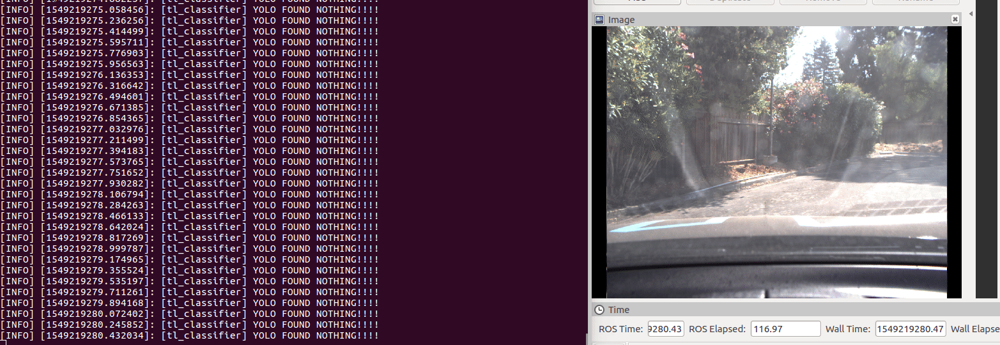 


## Simulator scenario 


 


# Architecture

The following architecture blocks comprise the project:


* Perception module
  * Traffic light detection ROS Node - comprised of a neural network model 
   
* Planning module
  * Waypoint updater ROS Node

* Control module
  * DBW (Drive By Wire) ROS Node

 

## Perception: Traffic light module node

### Simulator classifier

For traffic light classification in the simulator environment we tried a straight-forward approach: a convolutional neural network classifier which takes the entire frame as an input.

* Classification data was collected from the simulator itself and divided into for classes (red, yellow, green, nothing)
* We used 7 layers of convolutions with strides of 2X2 on the first 3, and max pooling between layers.


* To reduce the computation load, we only activate the classifier, when a traffic light is nearby (information is taken from the map input) 

this approach proved to be effective for the simulator environment and we did not need to add more complications to the system.

### Real world classifier

The straight-forward classification approach that worked for us in the simulator, was not effective when applied in real-world scenarios. the data is much noisier, and it doesn't make sense to feed the entire frame into the classifier. We decided to do the traffic light classification in two steps:

1. YOLO Detector 
    For detection, we took a pre-trained "off the shelf" detector that was trained on COCO dataset. Our detector of choice was Tiny-Yolo-v3 [(code)](https://github.com/qqwweee/keras-yolo3), [(paper and model weights)](https://pjreddie.com/darknet/yolo/). We integrated Yolo into our code and used it as a pre-processor that cropped out the traffic signs from Carla's video camera frames so we can feed them in our classifier.

2. Classifier 
   
    The classifier itself is composed of consequtive blocks of convolution and Max pooling, followed 50% dropouts and L2 regulizers.

    Overfitting has been found to be an issue during the training:

    1. initially, with only a small database, train accuracy was high and test extremely low. Increasing database size and populating it with various examples from completely different datasets achieved high performance
    2. Regularization such as dropouts and L2 regulaizers were introduced in order to avoid any algorithmic overfitting

    

   

   Various databases have been tried, first seperately and finally combined to a single training dataset:

   * BDD-Nexar database by [Berkeley deep drive](https://bdd-data.berkeley.edu/)
     * An extractor for traffic lights and condition has been built to extract images
     * This database has been found to be most relevant for its type of traffic lights and good quality images
     

        |  |   | 
        | :-----: | :-------------------: |
        | 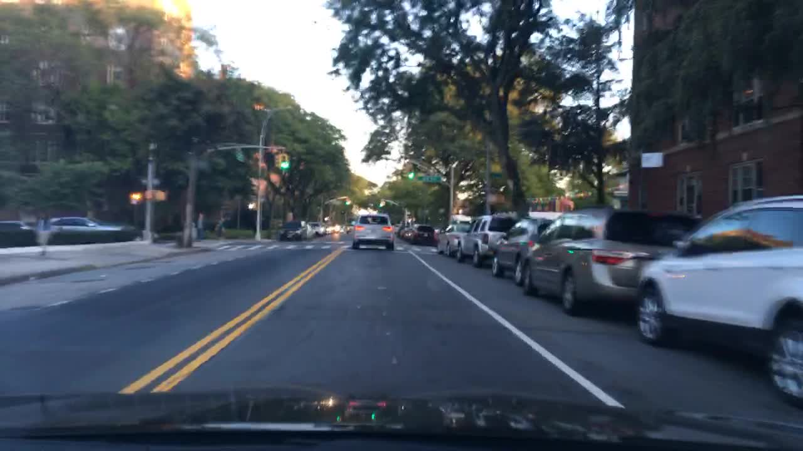  | 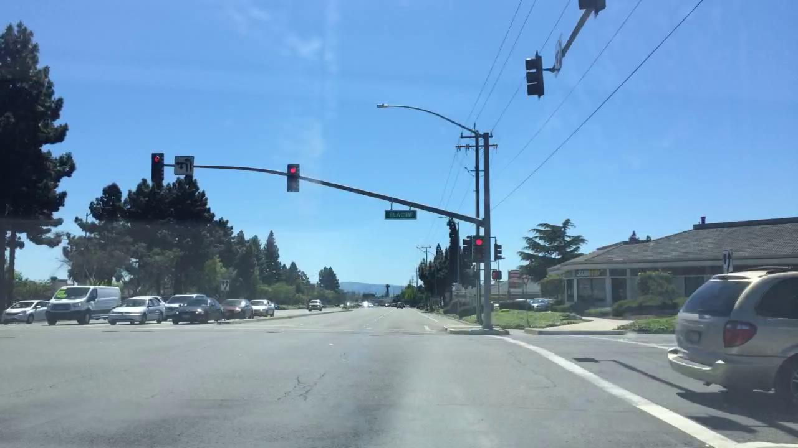 |
        | 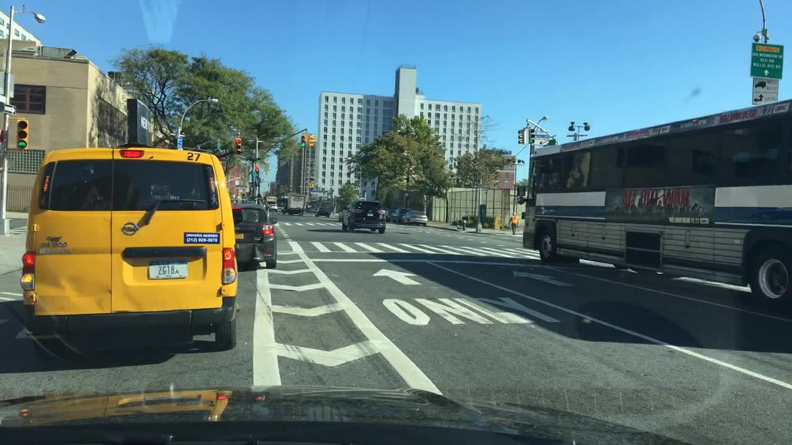  | 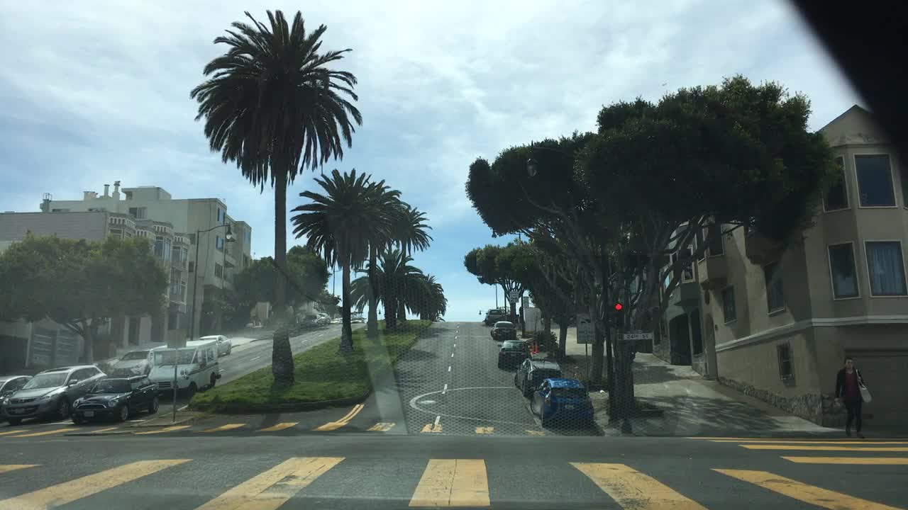 |


   * [Bosch small dataset](https://hci.iwr.uni-heidelberg.de/node/6132)
     * Compared to the BDD dataset, some images, such as the following were high quality, yet not enough data was available. Moreover, most of the traffic lights proved to be low resolution or too far. 
    
    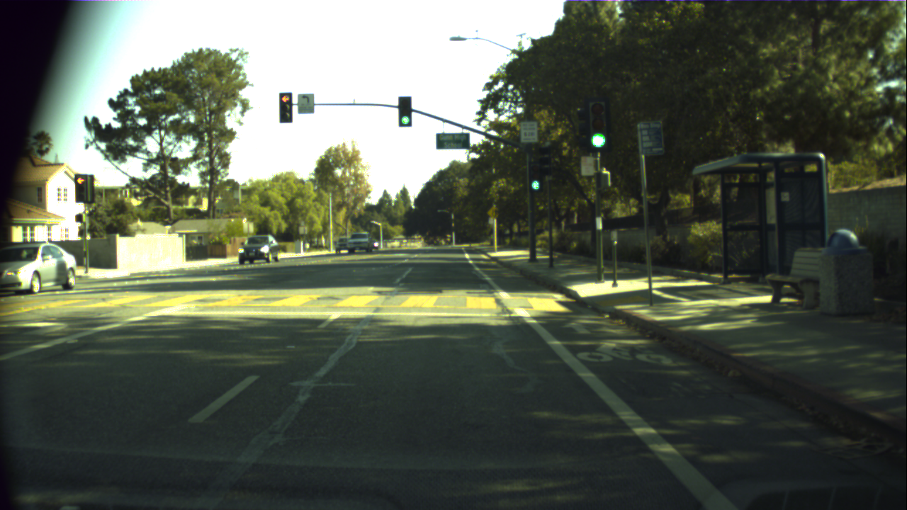

    * [LARA](http://www.lara.prd.fr/benchmarks/trafficlightsrecognition) -  Robotics Centre of Mines ParisTech

        |  |   | 
        | :-----: | :-------------------: |
        | 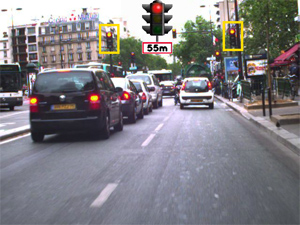  |  |

    * ROSBag carla files 
      * These were seperated to train and test, in order to include the expected traffic light and lighting conditions, in which the red light was seen in as yellow light. 

## Planning: Waypoint updater

In order to make the drive along the waypoint smoother and with faster reactions, so we changed the queue size of the waypoint follower from 10 (default value) to 2. it allows faster car reaction when there are minor errors that need to be corrected or when traffic lights suddenly change.

## Control: DBW module

The throttle PID controller has been tuned in the following manner:

1. Remove nonlinear constraints (max throttle)
2. Set all gains Kp, Ki, Kd to zero
3. Increase Kp until fast reaction, followed by stabile a sinusodial pattern
   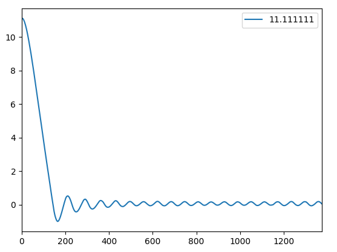
4.  Increase Kd until steady state frequencies are attenuated
    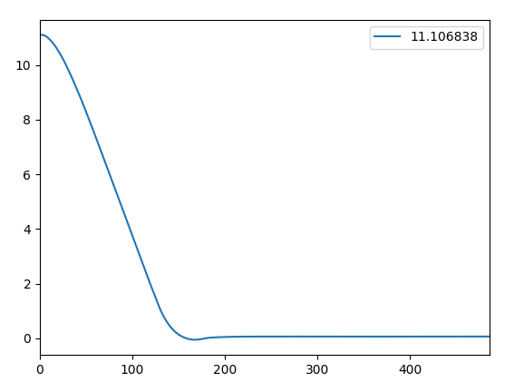
    And remained with the following steady-state error
    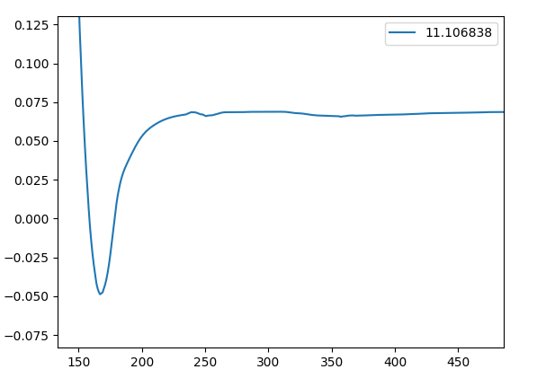

5.  Increase Ki to eliminate steady state error 
    It can be seen a decay in the velocity term with time
    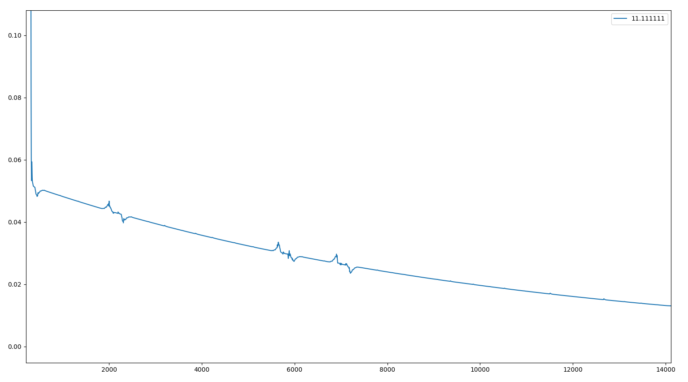

    Resulting in reaching the target velocity fast without fluctuations 
    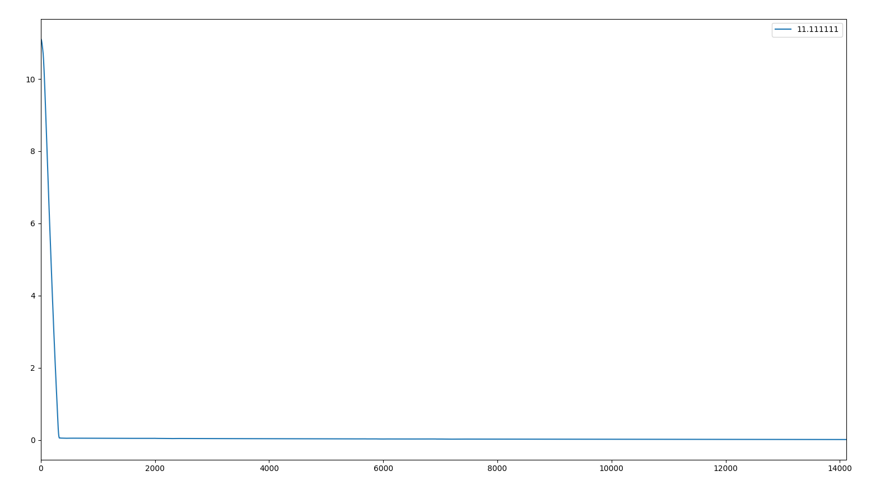

6. Introducing nonlinearities - small maximum allowed throttle for low speeds and higher maximum allowed throttle for higher speeds. 

### Native Installation

* Be sure that your workstation is running Ubuntu 16.04 Xenial Xerus or Ubuntu 14.04 Trusty Tahir. [Ubuntu downloads can be found here](https://www.ubuntu.com/download/desktop).
* If using a Virtual Machine to install Ubuntu, use the following configuration as minimum:
  * 2 CPU
  * 2 GB system memory
  * 25 GB of free hard drive space

  The Udacity provided virtual machine has ROS and Dataspeed DBW already installed, so you can skip the next two steps if you are using this.

* Follow these instructions to install ROS
  * [ROS Kinetic](http://wiki.ros.org/kinetic/Installation/Ubuntu) if you have Ubuntu 16.04.
  * [ROS Indigo](http://wiki.ros.org/indigo/Installation/Ubuntu) if you have Ubuntu 14.04.
* [Dataspeed DBW](https://bitbucket.org/DataspeedInc/dbw_mkz_ros)
  * Use this option to install the SDK on a workstation that already has ROS installed: [One Line SDK Install (binary)](https://bitbucket.org/DataspeedInc/dbw_mkz_ros/src/81e63fcc335d7b64139d7482017d6a97b405e250/ROS_SETUP.md?fileviewer=file-view-default)
* Download the [Udacity Simulator](https://github.com/udacity/CarND-Capstone/releases).

### Docker Installation
[Install Docker](https://docs.docker.com/engine/installation/)

Build the docker container
```bash
docker build . -t capstone
```

Run the docker file
```bash
docker run -p 4567:4567 -v $PWD:/capstone -v /tmp/log:/root/.ros/ --rm -it capstone
```

### Port Forwarding
To set up port forwarding, please refer to the [instructions from term 2](https://classroom.udacity.com/nanodegrees/nd013/parts/40f38239-66b6-46ec-ae68-03afd8a601c8/modules/0949fca6-b379-42af-a919-ee50aa304e6a/lessons/f758c44c-5e40-4e01-93b5-1a82aa4e044f/concepts/16cf4a78-4fc7-49e1-8621-3450ca938b77)

### Usage

1. Clone the project repository
```bash
git clone https://github.com/udacity/CarND-Capstone.git
```

2. Install python dependencies
```bash
cd CarND-Capstone
pip install -r requirements.txt
```
3. Make and run styx
```bash
cd ros
catkin_make
source devel/setup.sh
roslaunch launch/styx.launch
```
4. Run the simulator

### Real world testing
1. Download [training bag](https://s3-us-west-1.amazonaws.com/udacity-selfdrivingcar/traffic_light_bag_file.zip) that was recorded on the Udacity self-driving car.
2. Unzip the file
```bash
unzip traffic_light_bag_file.zip
```
3. Play the bag file
```bash
rosbag play -l traffic_light_bag_file/traffic_light_training.bag
```
4. Launch your project in site mode
```bash
cd CarND-Capstone/ros
roslaunch launch/site.launch
```
5. Confirm that traffic light detection works on real life images
